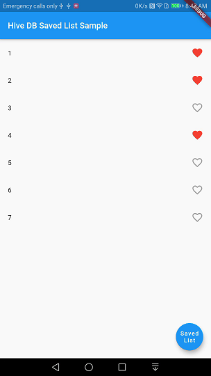
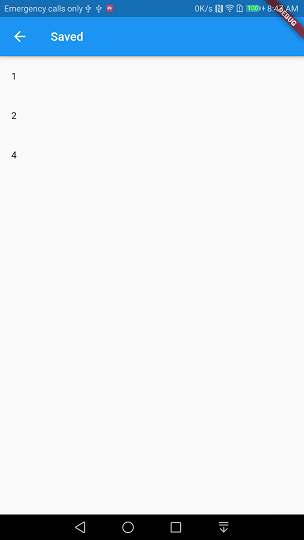

# HiveDB Flutter Saved List Sample Demo
> Sample for Getting list of saved items in a box. 

> Useful for building list for stored favourite items.

 

## Getting Started
clone this repo
```
git clone https://github.com/atiqsamtia/hivedb_flutter_saved_list_sample.git
```

Update dependencies 
```
cd hivedb_flutter_saved_list_sample
flutter packages get
flutter run
```

## Meta

Atiq Samtia– [@AtiqSamtia](https://twitter.com/atiqsamtia) – me@atiqsamtia.com

Distributed under the GPL3 license.

[https://github.com/atiqsamtia/hivedb_flutter_saved_list_sample](https://github.com/atiqsamtia/hivedb_flutter_saved_list_sample)

## Contributing

1. Fork it (<https://github.com/atiqsamtia/hivedb_flutter_saved_list_sample/fork>)
2. Create your feature branch (`git checkout -b feature/fooBar`)
3. Commit your changes (`git commit -am 'Add some fooBar'`)
4. Push to the branch (`git push origin feature/fooBar`)
5. Create a new Pull Request
